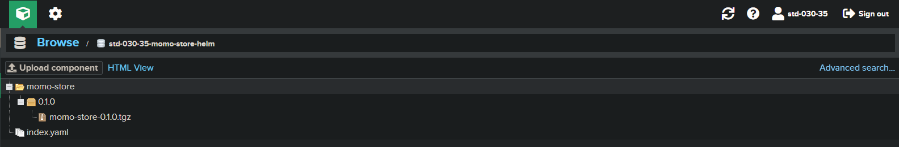

<div align="center"> 

 

##  *Momo Store aka Пельменная №2 &trade;*
*Сделано пользователем *std-030-35@praktikum-services.ru* он же **Алексей Дёмин***


---
  

---


## *Четвертый этап*
</div>

**Требования**:
> 🔎 Написан Helm-чарт для публикации приложения  
> 🔎 Helm-чарты публикуются и версионируются в Nexus

---
  
<br>

**Выполненная работа:**

- Был создан новый каталог Helm в репозитории - https://gitlab.praktikum-services.ru/std-030-35/momo-store/-/tree/main/kubernetes/Helm

 


---

<br>

- Добавлены все необходимые файлы.  

<br>

```yaml
### values.yaml

---
##############################################################################################################
# Frontend

# service.yaml
frontend:
  service:
    name: frontend
    port: 80

  # ingress.yaml
  ingress:
    enabled: true
    host: "vm.momo-store.cloud-ip.biz"
    tls:
      enabled: true
      secretName: "momo-store-tls"

  # deployment.yaml
  replicaCount: 1

  image:
    repository: gitlab.praktikum-services.ru:5050/std-030-35/momo-store/frontend
    tag: "1.0.1636715"
    pullPolicy: IfNotPresent

##############################################################################################################
# Backend

backend:
  # service.yaml
  service:
    name: backend
    port: 8081

  # vpa.yaml
  vpa:
    name: backend

  updatePolicy:
    updateMode:
      name: Initial

  resourcePolicy:
    minAllowed:
      cpu: 0
      memory: 0Mi
    maxAllowed:
      cpu: 1
      memory: 500Mi

  controlledValues: RequestsAndLimits

  # deployment.yaml
  replicas: 1
  revisionHistoryLimit: 15

  strategy:
    type: RollingUpdate
    maxUnavailable: 1
    maxSurge: 20%

  image:
    repository: gitlab.praktikum-services.ru:5050/std-030-35/momo-store/backend
    tag: "1.0.1636714"
    pullPolicy: IfNotPresent

  containerPort: 8081

``` 
  
  ```yaml
### frontend deploy

---
apiVersion: apps/v1
kind: Deployment
metadata:
  name: frontend
  labels:
    app: frontend
spec:
  replicas: {{ .Values.replicaCount }}
  revisionHistoryLimit: 12
  strategy:
    type: Recreate
  selector:
    matchLabels:
      app: frontend
  template:
    metadata:
      labels:
        app: frontend
    spec:
      containers:
        - name: frontend
          image: "{{ .Values.image.repository }}:{{ .Values.image.tag }}"
          imagePullPolicy: {{ .Values.image.pullPolicy }}
``` 
---  
<br>  

- Результат инсталяции helm chart

 

---  

<br>  

- Чарт был загружен в **Nexus**



<br>  

- В результате мне удалось выполнить все поставленные на четвертый этап задачи. 👌💪 😎  

<br>

>
> ✅ Написан Helm-чарт для публикации приложения  
> ✅  Helm-чарты публикуются и версионируются в Nexus

<br>

---


